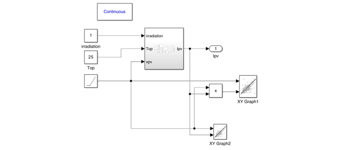
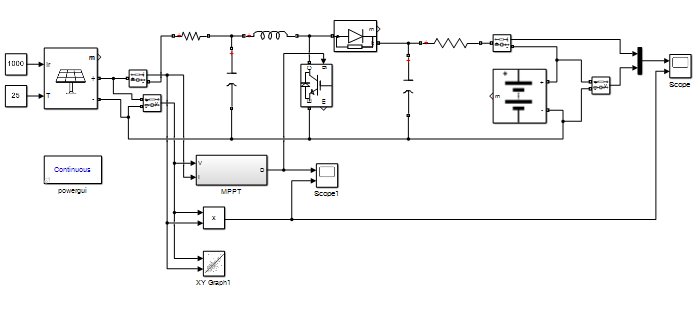
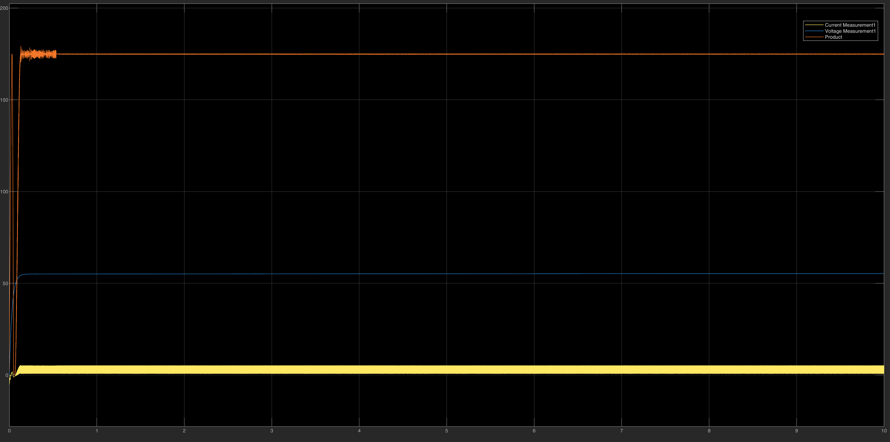
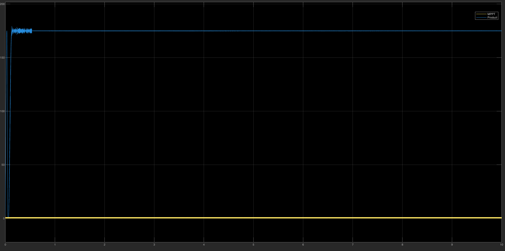
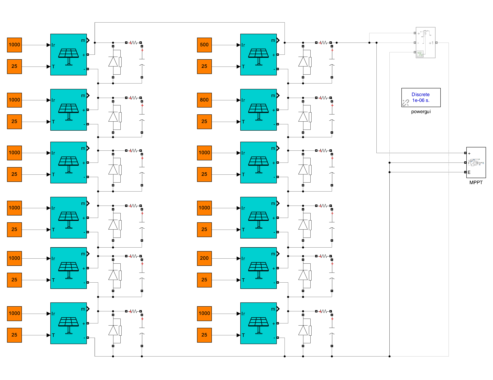
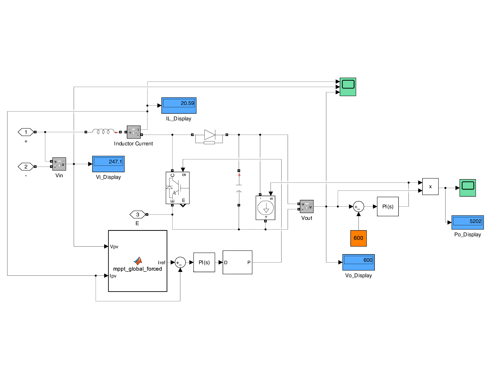

# ☀️ PV System Modeling & MPPT

This folder contains the Simulink models of the PV array and of the MPPT algorithms used in the Solar-Powered EV Charging Station project, progressing from the basic PV model to a **Global MPPT** that survives partial shading.

## 📂 Files

| File | Purpose |
| :--- | :--- |
| `pv_curves.slx` | Parameterized mathematical PV model that plots the I-V and P-V characteristics. |
| `MPPT_PO1.slx` | Perturb & Observe (P&O) logic block. |
| `Incremental_conductance.slx` | Complete PV + DC-DC boost + battery system with an **Incremental Conductance** MPPT (uniform irradiance). |
| `Central_Boost_MPPT_with_check.slx` | Complete system with the **Global MPPT (forced sweep)** for partial shading. |

---

## 1️⃣ PV Array Model (`pv_curves.slx`)
Instead of using a built-in block, the PV cell is modeled mathematically so the curves follow the manufacturer's datasheet.

* **Inputs:** irradiance (W/m²) and temperature (°C).
* **Outputs:** PV current and power versus PV voltage.
* **Parameters:** Voc, Isc, Ns, Iref and others are set inside the model.

Maximum power point at Standard Test Conditions:

---

## 2️⃣ Perturb & Observe (`MPPT_PO1.slx`)
The logic observes the change in power and voltage and moves the operating point (through the converter duty cycle) toward the maximum power point.

---

## 3️⃣ Incremental Conductance System (`Incremental_conductance.slx`)
Baseline closed-loop system: PV array → boost converter → battery (representing the DC bus) → MPPT controller.

* The controller (a MATLAB Function) compares `dI/dV` with `−I/V`: at the maximum power point the two are equal; otherwise the duty cycle is changed by a fixed step (**ΔD = 5·10⁻⁵**).

The scopes show the system settling at the maximum power point under steady-state conditions:

---

## 4️⃣ Global MPPT for Partial Shading (`Central_Boost_MPPT_with_check.slx`)
Under partial shading the P-V curve has several peaks, and P&O / Incremental Conductance can stay on a local peak. The `mppt_global_forced` MATLAB Function solves this with a **four-state machine**:

| State | What happens |
| :--- | :--- |
| **0 – Reset** | Command the PV voltage to the estimated open-circuit voltage (`V_oc_est = 300 V`). |
| **1 – Scan** | Sweep the target voltage **down** to `V_scan_min = 240 V` at **150 V/s**, recording the maximum power and the voltage where it occurs (`V_best`). |
| **2 – Return** | Move the target back up to `V_best`. |
| **3 – Hold** | Stay at `V_best` for **1 s**, then start a new scan (so the tracker adapts to changing shading). |

A PI loop (`Kp = 1`, `Ki = 200`, anti-windup limit ±50) regulates the PV voltage to the target by producing the **converter current reference** (limited to 0–35 A).

The scopes show the sweep, the detection of the global peak, and the lock onto it:

> **Note:** the sweep temporarily moves the system away from the maximum power point; the hold time sets the trade-off between tracking speed and energy lost while scanning.

---

### 🔧 How to Run
1. Open MATLAB and navigate to this folder.
2. Open the `.slx` file for the stage you want to study.
3. Press **Run** and inspect the Scope / XY Graph blocks.
