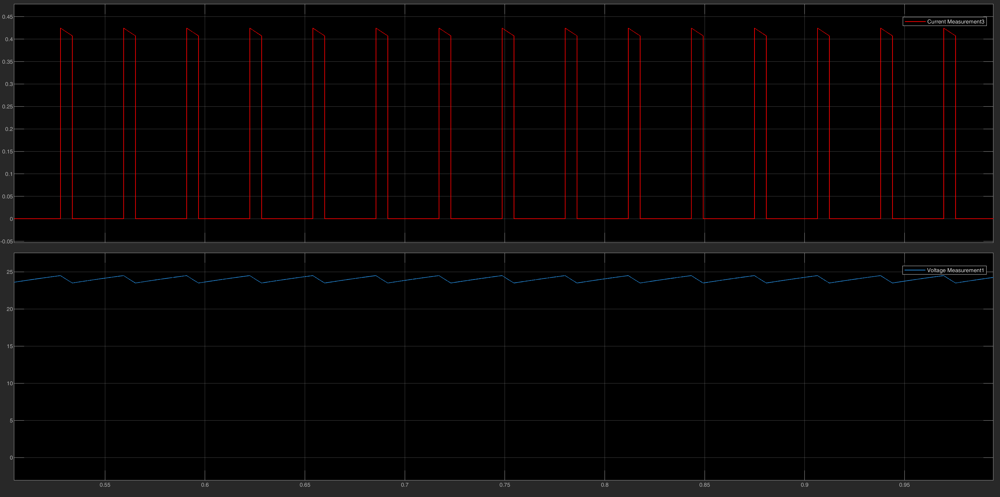

# ⚡ Interleaved Boost Converter

Simulation models of the DC-DC boost stage that connects the PV array to the 600 V DC link. The models follow a step-by-step design path: a basic open-loop boost, Thevenin-equivalent testing for control tuning, and the final closed-loop two-phase **Interleaved Boost Converter**.

## 📂 Design Path & Files

### Phase 1 — Open-loop concept validation
* **`Boost_Source_Open_Loop.slx`** — single-phase boost, checks the basic voltage step-up.
* **`Interleaved_Boost_Source_Open_Loop.slx`** — two-phase interleaved topology in open loop, used to observe the input-current ripple cancellation before adding feedback.

### Phase 2 — Control tuning with a Thevenin equivalent
* **`Boost_Thevenin_Equivalent.slx`** — the PV array is replaced by a Thevenin equivalent (controlled current source + DC voltage source) so the PI loops can be tuned without the non-linearity of the PV model (single-phase boost).
* **`Interleaved_Boost_Thevenin_Equivalent.slx`** — the tuned control applied to the two-phase interleaved converter.

### Phase 3 — Final integrated model
* **`Interleaved_Boost_Thevenin_Full_Control_ForDesign.slx`** — complete interleaved converter with closed-loop voltage and current control and 180° phase-shifted PWM.

---

## 🏗️ Final System Model
Two boost phases operate 180° out of phase. This reduces the input-current ripple and the stress on the input capacitor.

---

## 📊 Results

### 1. Ripple cancellation
The individual inductor currents (IL1, IL2) have a large ripple, but because they are 180° apart the **sum (total input current)** has a much smaller ripple.

### 2. Closed-loop output regulation
The PI controllers step the voltage up to the target and hold it steady under the simulated load.

---

### 🔧 How to Run
1. Open MATLAB and navigate to this folder.
2. Open the `.slx` file for the phase you want to review.
3. Press **Run** and open the Scope blocks to see switching behavior and control stability.
