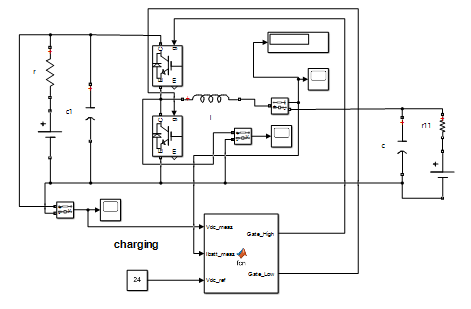

# 🔋 BESS & Two-Quadrant Chopper

Simulation models of the Battery Energy Storage System (BESS) and its bidirectional DC-DC converter (the **Two-Quadrant Chopper**), from low-power open-loop prototyping to closed-loop control under changing conditions.

> **Contributor note:** the Two-Quadrant Chopper was the main work area of the repository owner (design, firmware and testing) within the team project.

## 📂 Files

### 1️⃣ Open-loop models
* **`chopper_prototype_rating.slx`** — low-power open-loop model that mirrors the physical hardware prototype (validates switching logic and component selection).
* **`chopper_actual_rating.slx`** — open-loop model scaled to the real battery voltage/current ratings of the system.

### 2️⃣ Closed-loop models
* **`Quadrant2chopper2.slx`** — closed-loop test of one operating scenario; used as the first test bench for tuning.
* **`final2q_all_cases.slx`** — complete closed-loop model with all operating cases, including transitions between charging (buck mode) and discharging (boost mode) while the DC bus stays regulated.

---

## 🏗️ System
The chopper lets the battery **absorb** excess solar power or **supply** the DC bus when solar generation is not enough.

---

## ⚙️ Control Strategy
The controller is a MATLAB Function with a cascaded structure:

1. **Outer voltage loop (PI):** regulates the DC-bus voltage (`Kp = 0.1`, `Ki = 10`, integrator clamped to ±5 for anti-windup) and produces the battery-current reference.
2. **Current limiting:** the reference is saturated to the battery limits — **+3.1 A for charging** and **−10 A for discharging** (positive current = charging).
3. **Inner current loop (hysteresis, band h = 0.01 A):** switches the upper/lower device with complementary gate signals to keep the battery current inside the band.

> In the hardware prototype the inner loop is a **fixed-point PI running on an Arduino Uno** (10 kHz switching).

---

## 📊 Simulation Results
The scope shows the battery current reversing between charging and discharging while the DC-bus voltage stays regulated.

---

### 🔧 How to Run
1. Open MATLAB and navigate to this folder.
2. Open the `.slx` file for the test phase you want.
3. Press **Run** and open the Scope blocks to see the DC-bus voltage and the battery current.
