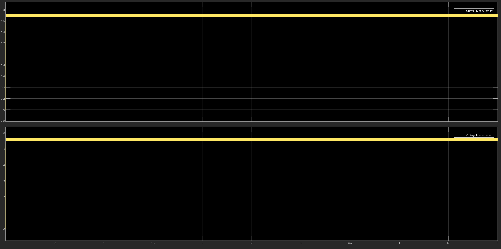
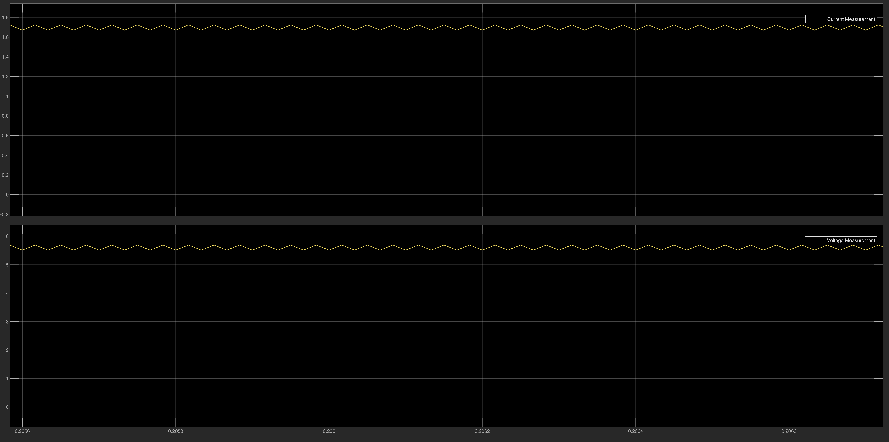
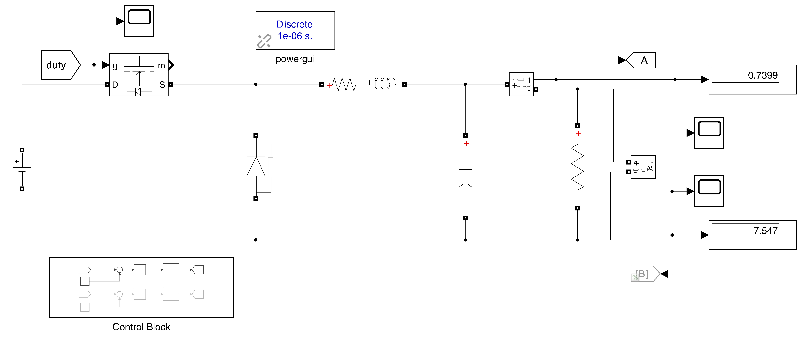
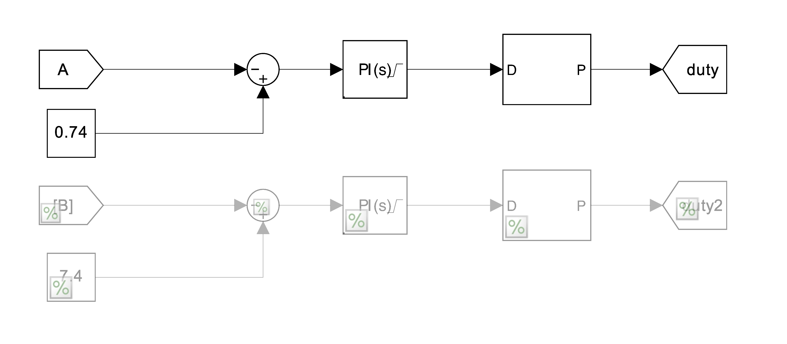
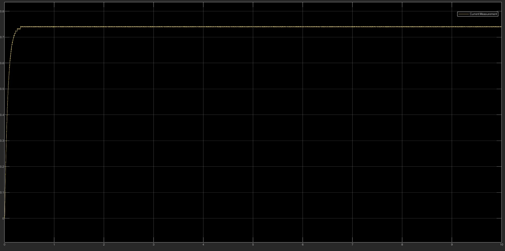
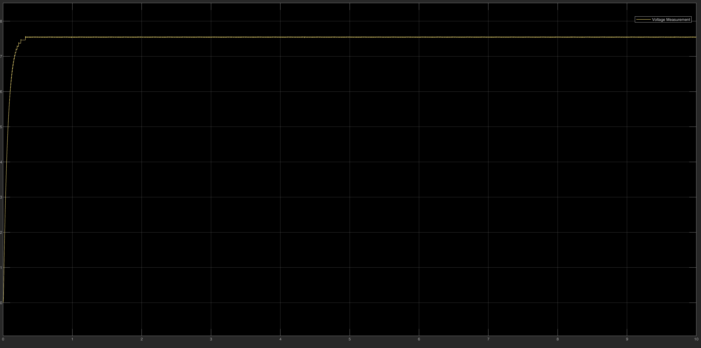
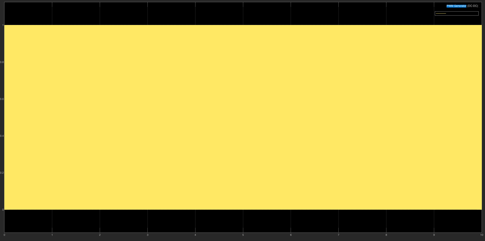
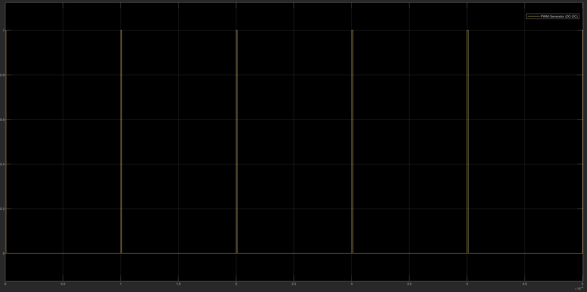

# 🚙 EV Buck Charger

Simulation of the final power stage: a buck converter that steps the DC voltage down to the battery voltage. The folder contains **two models**: the full-voltage open-loop converter of the project, and a **hardware-scale closed-loop converter** with the PI charging-current control used in the prototype.

## 📂 Files

| File | Description |
| :--- | :--- |
| `Buck.slx` | Open-loop model of the buck power stage fed from the **600 V DC link**: component sizing, switching and ripple. |
| `Buck_Controlled.slx` | Closed-loop model at the **prototype scale** (10 V input, resistive load) with PI current control and a 10 kHz PWM generator. |

The complete CC-CV supervisory design (switching between the two loops for a full charge cycle) is documented in the thesis (Chapter 5, Sec. 5.2.3).

---

## ⚙️ Control Strategy: CC-CV Charging
Battery charging follows a **Constant Current – Constant Voltage (CC-CV)** profile:

1. **Constant Current (CC):** when the battery is empty or at low state of charge, a PI loop regulates the charging current to a safe value while the battery voltage rises.
2. **Constant Voltage (CV):** when the battery approaches full charge, a PI voltage loop clamps the output voltage and the current decays naturally.

---

## 1️⃣ Open-Loop Model (`Buck.slx`)
The model checks that the converter steps the DC-link voltage down and delivers stable power to a resistive load.

**Output voltage and current** (the zoomed view checks that the switching ripple stays within the design target, e.g. inductor ripple ΔIL ≤ 20%):

**Output power:**

---

## 2️⃣ Closed-Loop Prototype-Scale Model (`Buck_Controlled.slx`)
This model reproduces the hardware test bench: a low-voltage buck converter charging a **7.4 V (2S Li-ion)** load with a regulated current.

| Parameter | Value |
| :--- | :--- |
| Input voltage | 10 V DC |
| Inductor / output capacitor | 2 mH / 200 µF |
| Load | 10.2 Ω resistor |
| Switching frequency | 10 kHz |
| Current reference (CC loop) | 0.74 A |
| Voltage reference (CV loop) | 7.4 V |
| PI current controller | Kp = 0.009186, Ki = 18.27 |
| PI voltage controller | Kp = 0.009529, Ki = 21.61 |
| Simulation step | 1 µs (fixed) |

### Control block
The **CC loop is active**: the measured current is compared with the 0.74 A reference, the PI controller produces the duty cycle, and the PWM generator drives the MOSFET. The **CV loop** (7.4 V reference, second PI and PWM generator) is built in the model but **commented out**, so this model demonstrates the CC stage, which is also the stage verified on the hardware prototype.

### Results
* **Current:** rises to the 0.74 A reference in about 0.3 s, without overshoot, and stays regulated.
* **Voltage:** settles at about 7.5 V across the load (7.547 V in the display block).

**PWM gate signal:**

---

### 🔧 How to Run
1. Open MATLAB and navigate to this folder.
2. Open `Buck.slx` (open-loop, 600 V input) or `Buck_Controlled.slx` (closed-loop, prototype scale).
3. Press **Run** and inspect the Scope and Display blocks.